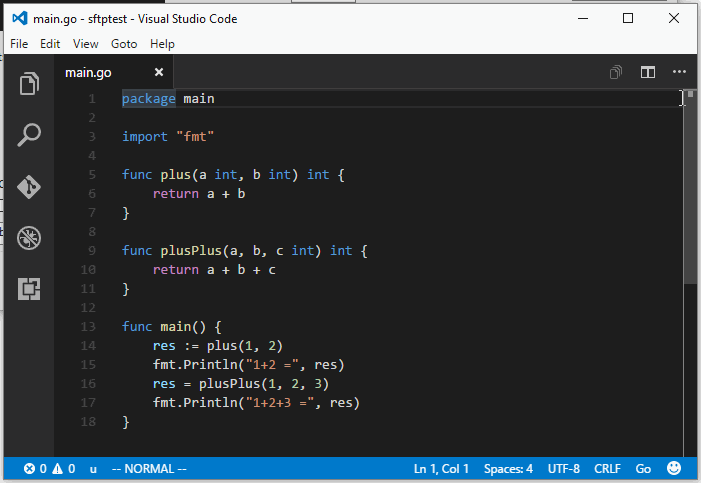

# Vimish
Vimish is a [Visual Studio Code](http://code.visualstudio.com/) extension that emulates many features of Vim.
Additionally, it has an experimental EasyMotion/Jumpy like support.

Vimish was written to provide an accurate vim experience in vscode after finding other vim plugins for vscode severely lacking in accuracy.
Vimish currently passes XXX/YYY tests in [this](#TODO) comprehensive test suite, which outdid the second best vim vscode plugin which passed XXX/YYY.

That said it is still a work in progress may be broken in ways the test suite does not catch.
The code is also not in the best shape but that will improve over time.

## Example

The jump motion can be triggered with `Q` followed by a character to search for, followed by as many letters as needed
to uniquely location a position. For example:

## Unsupported things that hopefully will be supported one day

* The 'repeat' command (currently works in a very limited capacity)
* Visual Line Mode
* Complex registers
* More correct cross-file marks
* Search motions
* More accurate Vim undo
* Custom keybindings
* A maintainable codebase

## Unsupported things that will probably never be supported

* Ex commands
* Visual Block Mode
* Motions/commands relating to the screen (unless VSCode adds support for this in the extension API)

## Contributing

Feel free to make issues for bugs or feature requests, or submit PRs in GitHub. As this is a hobbyist project
maintained by one person, I can't promise any timeline on when issues will be solved.
